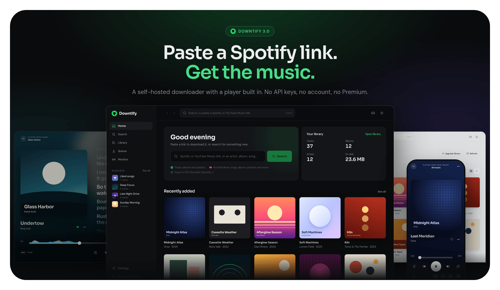

<h1 align="center">
  <a href="https://github.com/henriquesebastiao/downtify" target="_blank" rel="noopener noreferrer">
    <picture>
      
    </picture>
  </a>
  <br>
  Downtify
</h1>

<p align="center">
  <strong>Self-hosted music downloader. Paste a Spotify link, get a perfectly tagged audio file — no API keys, no account, no hassle.</strong>
</p>

<div align="center">

[](https://github.com/henriquesebastiao/downtify/actions/workflows/test.yml)
[](https://github.com/henriquesebastiao/downtify/releases)
[](/LICENSE)
[](https://github.com/henriquesebastiao/downtify/pkgs/container/downtify)
[](https://github.com/henriquesebastiao/downtify)

[Documentation](https://henriquesebastiao.github.io/downtify/) ·
[Installation](https://henriquesebastiao.github.io/downtify/getting-started/installation/) ·
[Features](https://henriquesebastiao.github.io/downtify/features/) ·
[Changelog](https://henriquesebastiao.github.io/downtify/changelog/)

</div>

<p align="center">
  
</p>

## Overview

Downtify is a self-hosted web app that turns Spotify and YouTube Music links into a tagged audio library. It never touches the Spotify API, and it needs no account and no Premium subscription. It also plays that library back, so what you download is one tab away from listening.

```
Spotify embed page  →  YouTube Music search  →  yt-dlp + ffmpeg + mutagen
   (metadata)             (audio match)            (download & tag)
```

1. **Metadata.** Track, album and playlist links are resolved from the public `open.spotify.com/embed` pages, so no Spotify credentials of any kind are needed.
2. **Audio match.** [`ytmusicapi`](https://ytmusicapi.readthedocs.io/) finds the best YouTube Music result by comparing durations. When there is no good match, standard YouTube is searched automatically ([details](https://henriquesebastiao.github.io/downtify/how-it-works/#fallback-to-standard-youtube)).
3. **Download and tag.** [`yt-dlp`](https://github.com/yt-dlp/yt-dlp) fetches the audio, `ffmpeg` converts it to the format you chose, and [`mutagen`](https://mutagen.readthedocs.io/) embeds title, artist, album, year and cover art.

All of it runs inside a single Docker container. See **[How it works](https://henriquesebastiao.github.io/downtify/how-it-works/)** for the full pipeline.

## Features

| | |
|---|---|
| **Download** | Spotify tracks, albums, playlists and artists (their releases and top songs); YouTube Music songs, albums, playlists and artists; free-text search; CSV imports from Soundiiz, TuneMyMusic and Exportify. MP3, FLAC, M4A, OGG or OPUS at the bitrate you pick. See [Download settings](https://henriquesebastiao.github.io/downtify/features/download-settings/) and [Library import](https://henriquesebastiao.github.io/downtify/features/library-import/). |
| **Tags and lyrics** | Title, artist, album, year and cover art embedded in every file. Plain and time-synced lyrics from LRCLIB and NetEase, tried in the order you choose. See [Lyrics](https://henriquesebastiao.github.io/downtify/features/lyrics/). |
| **Playlist Monitor** | Watch Spotify or YouTube Music playlists and artists; new tracks and new releases download on a schedule you set. See [Playlist Monitor](https://henriquesebastiao.github.io/downtify/features/playlist-monitor/). |
| **Built-in player** | Full-screen Now playing with synced lyrics, an editable queue, a sleep timer, keyboard shortcuts, media keys and a ten-band equalizer (experimental). See [Built-in player](https://henriquesebastiao.github.io/downtify/features/player/). |
| **Liked songs** | Tap the heart on a song and a *Liked songs* playlist of everything you have liked appears, in Downtify and in your media server. See [Liked songs](https://henriquesebastiao.github.io/downtify/features/liked-songs/). |
| **Podcasts** | Subscribe by RSS feed, Spotify link or name; new episodes download, tag and keep their resume position on their own. See [Podcasts](https://henriquesebastiao.github.io/downtify/features/podcasts/). |
| **Library** | Albums, artists, playlists and tracks in a grid or a list, with filtering, multi-select and download as a ZIP. **Upgrade library** repairs small covers, missing lyrics and incomplete tags on music you already have, without re-downloading. Pick a real photo and banner for an artist from YouTube Music, Deezer, Spotify or your own upload. See [Library catalog](https://henriquesebastiao.github.io/downtify/features/library-catalog/), [Upgrade library](https://henriquesebastiao.github.io/downtify/features/library-upgrade/) and [Artist photo & banner](https://henriquesebastiao.github.io/downtify/features/artist-images/). |
| **Playlist files** | Standard M3U files that Jellyfin, Navidrome and Plex pick up, plus each playlist's own cover art, saved before its tracks. A flat folder layout or one folder per artist. See [M3U export](https://henriquesebastiao.github.io/downtify/features/m3u-export/), [Playlist cover art](https://henriquesebastiao.github.io/downtify/features/playlist-cover-art/) and [File organization](https://henriquesebastiao.github.io/downtify/features/file-organization/). |
| **Integrations** | Optionally download from Soulseek through your own slskd server and mirror playlists into Navidrome, each with a **Test connection** button in Settings. See [slskd & Navidrome](https://henriquesebastiao.github.io/downtify/features/slskd-navidrome/). |
| **Interface** | Light and dark themes, one layout from phone to widescreen, an installable app ([PWA](https://henriquesebastiao.github.io/downtify/features/pwa/)), live download progress, update notices and eight languages. |

## Quick start

You only need [Docker](https://docs.docker.com/get-docker/).

```bash
docker run -d -p 8000:8000 --name downtify \
  -v /path/to/downloads:/downloads \
  -v downtify_data:/data \
  ghcr.io/henriquesebastiao/downtify
```

Open [http://localhost:8000](http://localhost:8000), paste a link and start the download. Replace `/path/to/downloads` with the folder where you want your music.

`/downloads` holds your audio files and `/data` holds Downtify's database and settings. Keep both persistent, or settings, likes and playlist tracking are lost when the container is recreated.

### Docker Compose

```yaml
services:
  downtify:
    container_name: downtify
    image: ghcr.io/henriquesebastiao/downtify:latest
    ports:
      - '8000:8000'
    volumes:
      - ./downloads:/downloads
      - downtify_data:/data
    restart: unless-stopped

volumes:
  downtify_data:
```

To serve it on another port, set `DOWNTIFY_PORT` and map the same port:

```yaml
ports:
  - '30321:30321'
environment:
  - DOWNTIFY_PORT=30321
```

The remaining deployment options (timezone, monitor sync time, cookies file, IPv4) are listed under **[Environment variables](https://henriquesebastiao.github.io/downtify/getting-started/environment-variables/)**. Everything else is configured from **Settings** in the web interface.

### Home server platforms

| Platform | |
|----------|---|
| Umbrel | [Install on Umbrel](https://apps.umbrel.com/app/downtify) |
| CasaOS | [Install on CasaOS](https://casaos.zimaspace.com/) |
| HomeDock OS | [Install on HomeDock](https://www.homedock.cloud/apps/downtify/) |

## What you can paste in

| Input | Example |
|-------|---------|
| Spotify track, album, playlist or artist | `open.spotify.com/track/…` |
| YouTube Music playlist | `music.youtube.com/playlist?list=…` |
| YouTube Music artist | `music.youtube.com/channel/UC…` or `music.youtube.com/@artist` |
| YouTube or YouTube Music video | `youtube.com/watch?v=…` |
| Free-text search | `The Night Owls Do I Still Recall` |
| Library export (CSV) | Soundiiz, TuneMyMusic, Exportify |

An artist link opens the artist's page, with their releases and a **Top Songs** button to pick from their most popular songs and download them, optionally as a playlist ([details](https://henriquesebastiao.github.io/downtify/features/top-songs/)). Artists can also be watched for new releases with the **Playlist Monitor**.

## Troubleshooting

Most download problems share one cause: YouTube wants a signed-in session. Upload a `cookies.txt` in **Settings → YouTube cookies** and they usually go away. If YouTube still rate-limits you, raise *Delay between downloads*, lower *Parallel downloads*, then try `DOWNTIFY_FORCE_IPV4=1`.

See **[Troubleshooting](https://henriquesebastiao.github.io/downtify/troubleshooting/)** for the full list of symptoms and fixes, and **[YouTube cookies](https://henriquesebastiao.github.io/downtify/features/youtube-cookies/)** for how to export the file.

## Translations

The interface is available in English, Spanish, Brazilian Portuguese, French, Turkish, Hungarian, Greek and Bulgarian. Switch language in **Settings → Language**; the choice is saved in the browser and applies without a reload.

### Contributing translations

Adding a language is a small change and needs no tooling beyond the existing Vite setup:

1. Copy `frontend/src/i18n/locales/en.js` to a new file named after an [IETF language tag](https://en.wikipedia.org/wiki/IETF_language_tag) (`de.js`, `it.js`, `pt-PT.js`).
2. Translate the values. Keep the keys and placeholder tokens (`{count}`, `{name}`, `{file}`) unchanged, and set `language.name` to the language's native name.
3. Register the locale in `frontend/src/i18n/index.js`.

Missing keys fall back to English, so a partial translation is welcome. The full walkthrough, with the registration snippet and tips, is in **[Internationalization](https://henriquesebastiao.github.io/downtify/features/internationalization/)**.

## Documentation

| | |
|---|---|
| [Getting started](https://henriquesebastiao.github.io/downtify/getting-started/) | Installation, Docker Compose, one-click installs and environment variables |
| [Features](https://henriquesebastiao.github.io/downtify/features/) | One page per feature, with every option explained |
| [How it works](https://henriquesebastiao.github.io/downtify/how-it-works/) | The metadata, matching and tagging pipeline |
| [Troubleshooting](https://henriquesebastiao.github.io/downtify/troubleshooting/) | Symptoms, causes and fixes |
| [API reference](https://henriquesebastiao.github.io/downtify/api-reference/) | Every endpoint the web interface uses |
| [Changelog](https://henriquesebastiao.github.io/downtify/changelog/) | What changed in each release |

---

> [!WARNING]
> Users are responsible for their actions and any legal consequences. Downtify does not support unauthorized downloading of copyrighted material and takes no responsibility for user actions.

## Contributing

Contributions, issues and feature requests are welcome. Check the [issues page](https://github.com/henriquesebastiao/downtify/issues) or open a pull request.

Before sending a pull request, read [**CONTRIBUTING.md**](./CONTRIBUTING.md). It covers local setup, the coding and formatting standards (Ruff for Python, Prettier for the frontend), testing requirements, commit conventions and the pull request checklist.

If Downtify has been useful to you, a star on GitHub helps other people find it.

## Support

There are many ways to support Downtify:

- Use it! Write about it! Star it! If you love Downtify, drop me a line and tell me what you love.
- Blog about Downtify to spread the word. If you're good at writing, send PRs to improve the documentation at [downtify.henriquesebastiao.com](https://downtify.henriquesebastiao.com/).
- Sponsor my work at https://www.buymeacoffee.com/henriquesebastiao

<a href="https://www.buymeacoffee.com/henriquesebastiao" target="_blank"></a>

## License

Licensed under the [GPL-3.0](https://github.com/henriquesebastiao/downtify?tab=GPL-3.0-1-ov-file#readme) License.

Icons by [Font Awesome](https://fontawesome.com) (Free, [CC BY 4.0](https://fontawesome.com/license/free)), loaded via [Iconify](https://iconify.design).
